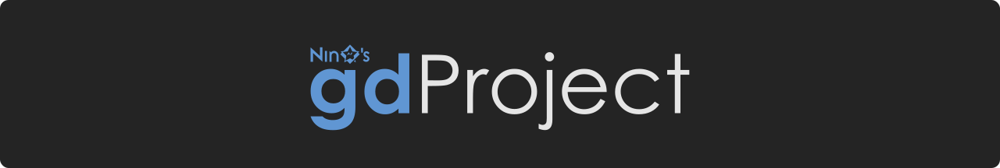

[][home]

# Overview

A collection of add-ons for the Godot Engine.

## Add-ons

-  **[NinePatchSprite2D](https://github.com/ninstar/Godot-NinePatchSprite2D)** - A Node2D that displays a texture by keeping its corners intact, but tiling its edges and center.
-  **[RangeContainer](https://github.com/ninstar/Godot-RangeContainer)** - A ScrollContainer that can be controlled by external Range nodes.
-  **[RemoteContainer](https://github.com/ninstar/Godot-RemoteContainer)** - RemoteContainer pushes its own transform to another Control derived node in the scene.
-  **[ResourceOverrider](https://github.com/ninstar/Godot-ResourceOverrider)** - A node that replaces Resources on-the-fly using suffixes.
-  **[IconTexture](https://github.com/ninstar/Godot-IconTexture)** - A texture that draws an icon of a Theme resource.
-  **[StateMachine Nodes](https://github.com/ninstar/Godot-StateMachineNodes)** - A set of Finite State Machine nodes for organizing and processing logic.

> [!NOTE]
> The add-ons provided in this repository as submodules are always based on their latest versions.

## Usage

1. Clone the repository and its submodules:
```bash
git clone --recurse-submodules https://github.com/ninstar/gdProject.git
```
2. Open ``/project.godot`` in Godot and run it.
3. The ☰ menu provides a list of all available examples that you can choose from.
    - All examples are self contained and can be easily copied to any other project along with their respective add-ons.


## Archive

> [!WARNING]
> The following add-ons are unmaintained and no longer included in the project and have not been tested with newer versions of Godot.
-  **[AudioSyncPlayer Nodes](https://github.com/ninstar/Godot-AudioSyncPlayerNodes)** ``Godot 4.2`` - A set of Audio Player nodes that can be synchronized.


# Credits

- **Code & Resources** - Ny'hrarr (NinStar)

[home]: https://ninstars.blogspot.com/p/gdproject.html
