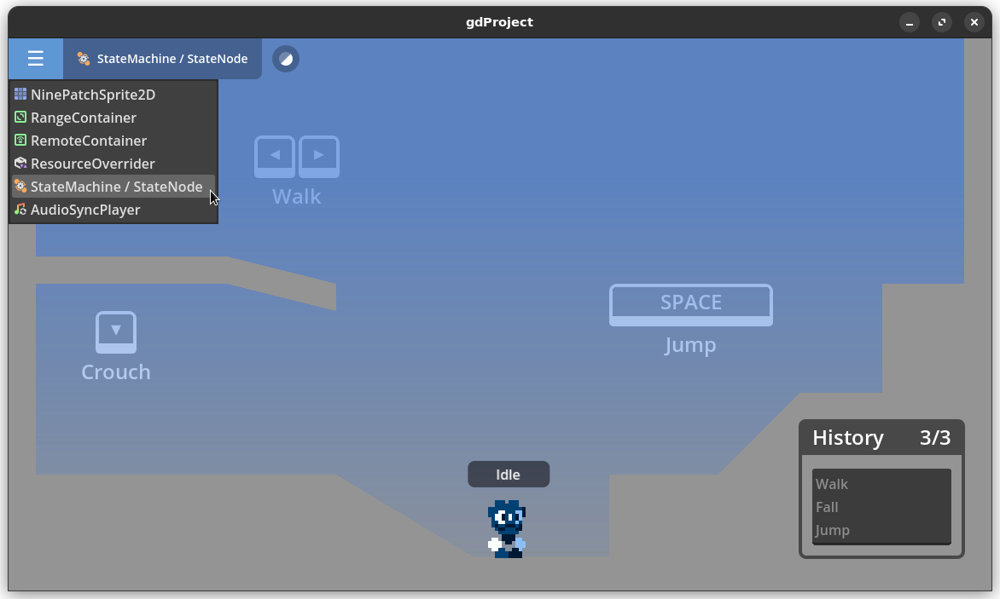

[][home]

# Overview

A collection of add-ons and utilities for Godot 4.x.

```bash
git clone https://github.com/ninstar/gdProject.git
```

## Add-ons

-  **[NinePatchSprite2D](./addons/nine_patch_sprite_2d)** - A Node2D that displays a texture by keeping its corners intact, but tiling its edges and center.
-  **[RangeContainer](./addons/range_container)** - A ScrollContainer that can be controlled by external Range nodes.
-  **[RemoteContainer](./addons/remote_container)** - RemoteContainer pushes its own transform to another Control derived node in the scene.
-  **[ResourceOverrider](./addons/resource_overrider)** - A node that replaces Resources on-the-fly using suffixes.
-  **[StateMachine](./addons/state_machine_nodes)** - A node used to manage and process logic on a StateNode.
  -  **StateNode** - A node that functions as a state for a StateMachine.

> Once an add-on is enabled, its documentation can be accessed directly from the IDE (``F1``).


## Examples

Every add-on in this repository has an example scene, just open the project in Godot and run it (``F5``).



Most example scenes are self-contained and can be easily transferred to any project.

# Credits

- **Code & Resources** - NinStar

[home]: https://ninstars.blogspot.com/p/gdproject.html
